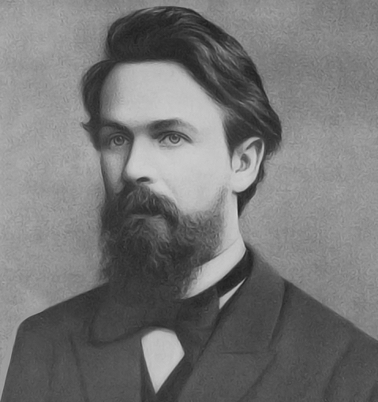
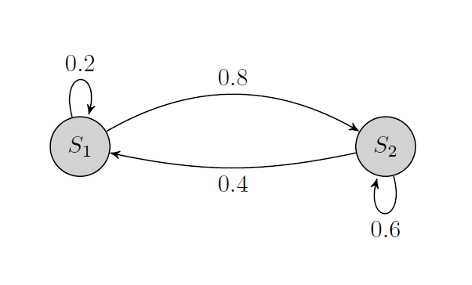
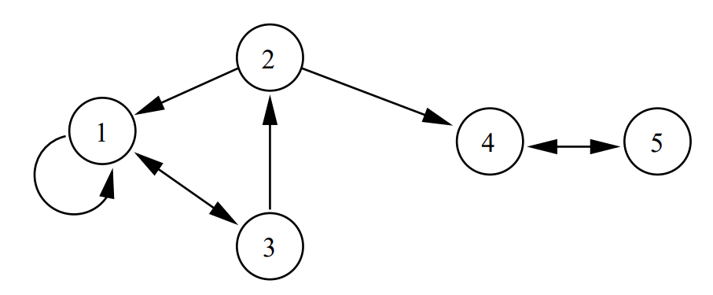
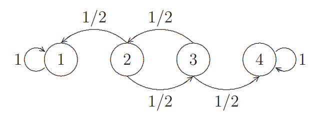

# Chaînes de Markov
La notion de ce qu'on appelle aujourd'hui une chaîne de Markov a été conçue par le mathématicien russe A.A. Markov. 

<center>
{width=20% height=20%}
</center>

Une chaîne de Markov est un système mathématique qui subit des transitions d'un état à un autre selon un ensemble donné de règles probabilistes. Les chaînes de Markov sont des processus stochastiques, mais ils diffèrent en ce sens qu'ils doivent manquer de "mémoire". Autrement dit, la probabilité de l'état suivant du système ne dépend que __seulement__ de l'état actuel du système.

Les chaînes de Markov sont largement utilisées dans de nombreux domaines tels que la finance, la théorie des jeux et la génétique.

## Définitions et exemples

Soit $X_0, X_1,\ldots, X_n, \ldots$ une suite de variables aléatoires sur un espace de probabilité $(\Omega,\mathcal{A}, \mathbb{P})$ à valeurs dans $E$ (fini ou infini dénombrable).

```{definition}
La suite $(X_n)_{n \in \mathbb{N}}$ est une chaîne de Markov si pour tout $n \in \mathbb{N}$ et pour tout $(x_0,x_1, \ldots,x_{n+1}) \in E^{n+2}$ tel que $\mathbb{P}(X_n=x_n, X_{n-1}=x_{n-1},\ldots, X_0=x_0) >0$, $\mathbb{P}(X_{n+1}=x_{n+1}|X_n=x_n,X_{n-1}=x_{n-1},\ldots, X_0=x_0)$ ne dépend que des valeurs $n$, $x_n$ et $x_{n+1}$.
```
L'ensemble $E$ est appelé l'$\color{blue}{\mathbf{\text{espace des états}}}$ de la chîne de Markov et les $x_i$ sont appelés $\color{blue}{\mathbf{\text{états}}}$.
```{proposition}
Soit $(X_n)_{n \in \mathbb{N}}$ une chaine de Markov d'espace d'états $E$. Pour tout $n \in \mathbb{N}$ et pour tout $(x_0,x_1x\ldots,x_{n+1})\in E^{n+2}$, on a
$$\mathbb{P}(X_{n+1}=x_{n+1}|X_n=x_n,X_{n-1}=x_{n-1},\ldots, X_0=x_0)=\mathbb{P}(X_{n+1}=x_{n+1}|X_n=x_n)$$
```

```{definition}
Une chaîne de Markov $(X_n)_{n \in \mathbb{N}}$ est dite homogène (dans le temps) si $\mathbb{P}(X_{n+1}=x_{n+1}|X_n=x_n)$ ne dépend pas de $n$. 
```

La dynamique du processus est alors entièrement caractérisé par les $p_{ij}=\mathbb{P}(X_{n+1}=j|X_n=i)$, appelés $\color{blue}{\mathbf{\text{probabilités de transitions}}}$ de l'état $i$ à l'état $j$ si la chaîne est homogène, ou plus généralement
$$ p_{ij}^{(n)}=\mathbb{P}(X_{n+1}=j|X_n=i)$$
```{definition}
Une matrice $P=(P_{ij},i,j \in E)$ est une matrice $\color{blue}{\mathbf{\text{stochastique}}}$, ou matrice $\color{blue}{\mathbf{\text{de transition}}}$ si chaque ligne $P_i=(P_{ij}, j \in E)$ est une distribution de probabilité.
```

Pour tout $i,j \in E$, $p_{ij}$ peut alors s'interpréter comme la probabilité d'aller à l'état $j$ sachant qu'on se trouve à l'état $i$ à l'instant précédent.

Par exemple, la matrice suivante est une matrice stochastique

$$
P=\left( 
\begin{array}{cc}
0.2 & 0.8\\
0.4 & 0.6
\end{array}
\right)
$$
```{r, comment=NA}
(P<-matrix(c(0.2,0.4,0.8,0.6),nc=2))
# vérifions que P est une matrice stochastique
P>=0 & P<=1  # 0<= p <=1
rowSums(P)==1 # somme pj = 1

```

A toute matrice de transition, on peut associer un $\color{blue}{\mathbf{\text{graphe orienté}}}$. Les sommets sont les états de la chaîne, et l'orientation est donnée par la probabilité $p_{ij}>0$.

Le graphe de la chaîne associé à la matrice de transition définie ci-dessus est donné par:

```{r, echo=F, fig.align='center'}

```
```{r, comment=NA, message=FALSE, warning=FALSE}
# représenter un graphe sous R
# install.packages(diagram)
library(diagram) # charger l'extension 'diagram'
P<-matrix(c(0.2,0.4,0.8,0.6),nc=2)
colnames(P) <- c("S1", "S2")
rownames(P) <- c("S1", "S2")
plotmat(t(P), pos=c(2),box.size = 0.05, box.prop = 0.7, 
      box.col = "gray", arr.pos = 0.6, relsize = 1.1)
```


```{example}
Lors d'une ronde, une méthode simple pour tromper l'ennemi et d'avance ou reculer d'une manière aléatoire, en tirant pile ou face. On désigne par $X_n$ la position de garde à l'instant $n$. L'évolution peut se modéliser à l'aide d'une matrice de transition 
$$
 P=\begin{array}{c c} &
\begin{array}{c c c c} \color{blue}{N} & \color{blue}{E} & \color{blue}{S} & \color{blue}{O} \\
\end{array}
\\
\begin{array}{c c c c}
\color{blue}{N} \\
\color{blue}{E}\\
\color{blue}{S} \\
\color{blue}{O}
\end{array}
&
\left(
\begin{array}{c c c c}
0 & 0.5 & 0 & 0.5 \\
0.5 & 0 & 0.5 & 0 \\
0 & 0.5 & 0 & 0.5 \\
0.5 & 0 & 0.5 & 0
\end{array}
\right)
\end{array}$$
```

L'ensemble des états, $E$, est formé de 4 états {N, E, S, O}. La probabilité de se déplacer à l'état $E$ sachant qu'on se trouve à l'état $N$ est:
$$
\mathbb{P}(X_{n+1}=E|X_n=N)=p_{12}=0.5
$$
Le graphe orienté correspondant à cette matrice de transition est:
```{r, comment=NA}
nn=c("N","E", "S","O")
P1=matrix(rep(c(0,0.5,0,0.5,0.5,0,0.5,0),2), nc=4,
          dimnames = list(nn,nn))
plotmat(t(P1), box.size = 0.05, box.prop = 0.6, box.col = "gray", 
          arr.pos = 0.7, relsize = 0.9)
```
```{example}
La tendance d'un marché boursier peut être haussière (H), ou baissière (B) ou en consolidation (marché en range) (C). Le graphe associé est donné comme suit:
```
```{r, comment=NA, echo=FALSE}
nom=c("H","B", "C")
PM=matrix(c(0.85,0.05,0.5,0.06,0.87,0.25,0.09,0.08,0.25),
          nc=3, dimnames = list(nom,nom))
plotmat(t(PM), box.size = 0.06, box.prop = 0.5, box.col = "gray", 
          arr.pos = 0.6, relsize = 0.85,dtext = 0.6)
```

On déduit la matrice de transition 
$$
P=\left( 
\begin{array}{ccc}
0.85 & 0.06 & 0.09 \\
0.05 & 0.87 & 0.08 \\
0.5 & 0.25 & 0.25
\end{array}
\right)
$$
On note qu'un jour haussier est suivi par un autre jour haussier dans 85% des temps, par un jour baissier dans 6% des temps et par un jour de consolidation dans 9% des temps.
```{exercise}
Dans un certain pays, il ne fait jamais beau deux jours de suite. Si un jour il fait beau, le lendemain il peut neiger ou pleuvoir avec autant de chances. Si un jour il pleut ou il neige, il y a une chance sur deux qu'il ait changement de temps le lendemain, et s'il y a changement, il y a une chance sur deux que ce soit pour du beau temps.

   1. Former une chaîne de Markov et en déterminer sa matrice de transition. Représenter le graphe orienté associé.
   2. Si on suppose l'on a que deux états (beau temps et mauvais temps), déterminer la matrice de la nouvelle chaîne ainsi obtenue.


```

 __Solution 1.1__

  1. On a l'ensemble des états suivants $E=\{B,P,N \}$. Le temps pour un jour ne dépend que seulement de temps du jour précédent. On a donc un processus de Markov. 
  
  Il ne fait jamais beau deux jours de suite $\Longrightarrow \mathbb{P}(X_{n+1}=B|X_n=B)=0$.
  
  Si un jour il fait beau, le lendemain il peut neiger ou pleuvoir avec autant de chances $\Longrightarrow \mathbb{P}(X_{n+1}=P|X_n=B)=\mathbb{P}(X_{n+1}=N|X_n=B)=0.5$.
  
  Si un jour il pleut ou il neige, il y a une chance sur deux qu'il ait changement de temps le lendemain $\Longrightarrow P(X_{n+1}=P|X_n=P)=\mathbb{P}(X_{n+1}=N|X_n=N)=0.5$.
  
  et s'il y a changement, il y a une chance sur deux que ce soit pour du beau temps $\mathbb{P}(X_{n+1}=B|X_n=P)=\mathbb{P}(X_{n+1}=B|X_n=N)=0.5\times 0.5=0.25$.
  
  Ainsi, la matrice stochastique est donnée par:
  $$
  P=\left( 
  \begin{array}{ccc}
  0 & 0.5 & 0.5\\
  0.25 & 0.5 & 0.25\\
  0.25 & 0.25 & 0.5
  \end{array}
  \right)
  $$
  et le graphe orienté associé est:
```{r, comment=NA}
noms=c("B","P","N")
PB=matrix(c(0,0.25,0.25,0.5,0.5,0.25,0.5,0.25,0.5), nc=3,
          dimnames = list(noms,noms))
plotmat(t(PB), box.size = 0.06, box.prop = 0.5, box.col = "gray", 
          arr.pos = 0.6, relsize = 0.85,dtext = 0.6)
```

   2. Le nouvel ensemble des états est $E_1=\{B, M \}$, $M$ pour désigner mauvais temps (soit il pleut, soit il neige).
   $$\mathbb{P}(X_{n+1}=B|X_n=M)=\mathbb{P}(X_{n+1}=B|X_n=P)+\mathbb{P}(X_{n+1}=B|X_n=N)=0.5+0.5=1$$
   \(\mathbb{P}(X_{n+1}=B|X_n=B)=0 \).
  \begin{align*} 
  \mathbb{P}(X_{n+1}=M|X_n=M)&=\mathbb{P}(X_{n+1}=P|X_n=P)+\mathbb{P}(X_{n+1}=P|X_n=N)\\
  & = \mathbb{P}(X_{n+1}=N|X_n=N)+\mathbb{P}(X_{n+1}=N|X_n=N)\\
  &= \dfrac{1}{2}+\dfrac{1}{4}= \dfrac{3}{4}
  \end{align*}
\begin{align*} 
  \mathbb{P}(X_{n+1}=M|X_n=B)&=\mathbb{P}(X_{n+1}=P|X_n=B)=\mathbb{P}(X_{n+1}=N|X_n=B)\\
  &= \dfrac{1}{4}
  \end{align*}  
Ainsi, la matrice de transition d'espace d'états $\{B,M\}$ est:

$$
P_1=\left( 
\begin{array}{cc}
0 & 1\\
\frac{1}{4} & \frac{3}{4}
\end{array}
\right)
$$

## Loi des $X_n$

Le comportement d’une chaîne de Markov $X$ dépend entièrement de sa matrice de transition $P$, et de la position initiale $X_0$. On appelle $\mu_0$ la $\color{blue}{\mathbf{\text{loi initiale}}}$ de $X$, c’est une mesure définie par
$$
\mu_0(x)=\mathbb{P}(X_0=x)
$$
Connaissant $\mu_0$ et $P$, on peut calculer directement la loi de $X_n$.

La distribution de $X_1$ est:

\begin{align*} 
\mathbb{P}(X_1 = j) = \sum_{i=1}^N \mathbb{P}(X_1 = j | X_0 = i)\mathbb{P}(X_0 = i) \\
=
\sum_{i=1}^N \mu_0(i) p_{ij}=(\mu_0 P)_j\; \text{ pour tout }j
\end{align*}

La distribution de $X_2$ est:

\begin{align*} 
\mathbb{P}(X_2 = j) = \sum_{i=1}^N \mathbb{P}(X_1 = j | X_0 = i)\mathbb{P}(X_0 = i) \\
=
\sum_{i=1}^N \mu_0(i) (P^2)_{ij}=(\mu_0 P^2)_j\; \text{ pour tout }j
\end{align*}

```{theorem}
Soit $\{X_0, X_1, X_2, \ldots \}$ une CM et $P$ sa matrice de transition carré d'ordre $N$. Si la distribution initiale, $\mu_0$ est donnée, alors la distribution de probabilité de $X_n$ est donnée par $\mu_0 P^n$.
$$
X_0 \sim \mu_0 \Longrightarrow X_n \sim \mu_0 P
$$

```

__Probabilité d'une trajectoire__

Rappelons qu'une trajectoire est une séquence
de valeurs pour $X_0, X_1,\ldots, X_n$. La propriété de Markov nous permet de trouver la probabilité de n'importe quelle trajectoire en multipliant la probabilité de départ et toutes les probabilités à un pas ultérieures.

```{proposition}
Pour toute suite $\{x_0, x_1, \ldots , x_n\}$ dans $E$, on a
$P(X_0 = x_0, X_1 = x_1,X_2 = x_2, \ldots , X_n = x_n)
=\mu_0(x_0)P(x_0, x_1)P(x_1, x_2)\ldots P(x_{n−1}, x_n)$.
```

```{theorem, name="Equations de Chapman-Kolmogorov"}
Pour tout $(i, j) \in E^2 et tout couple $(m, n)$ d’entiers positifs, on a l’identité :
  $$
\mathbb{P}(X_{m+n} = j|X_0 = i) = \sum_{k\in E}
\mathbb{P}(X_m = k|X_0 = i)\mathbb{P}(X_n = j|X_0 = k)$$
$$\text{ou encore }
p^{(m+n)}_{ij} = \sum_{k \in E} p^{(m)}_{ik} p^{(n)}_{kj} \text{ ou } (P^{m+n})_{ij}=(P^m)_{ik}(P^n)_{kj}$$
```


```{example}
Soit une CM définie par la matrice de transition $$
  P=\left( 
  \begin{array}{cccc}
  0.2 & 0.4 & 0.1 & 0.3\\
  0 & 0.5 & 0.4 & 0.1\\
  0.1 & 0 & 0.6 & 0.3\\
  0.4 & 0.15 & 0.25 & 0.2
  \end{array}
    \right)
  $$
et de distribution initiale $\mu_0 \sim (0.3,0.2,0.5,0)$.

   1. Déterminer $\mathbb{P}(X_2=2)$.
   2. Déterminer la probabilité des trajectoires: 1,2,3,4 et 2,3,1,1. 

```

  1. $\mathbb{P}(X_2=2)=\left(\mu_0 P^2 \right)_{2}$. 

\begin{align*}
\text{Or } \mu_0 P^2=(0.3,0.2,0.5,0) \left( 
  \begin{array}{cccc}
  0.2 & 0.4 & 0.1 & 0.3\\
  0 & 0.5 & 0.4 & 0.1\\
  0.1 & 0 & 0.6 & 0.3\\
  0.4 & 0.15 & 0.25 & 0.2
  \end{array}
    \right) \left( 
  \begin{array}{cccc}
  0.2 & 0.4 & 0.1 & 0.3\\
  0 & 0.5 & 0.4 & 0.1\\
  0.1 & 0 & 0.6 & 0.3\\
  0.4 & 0.15 & 0.25 & 0.2
  \end{array}
    \right)\\
    = (0.167,0.193,0.41,0.23)\qquad \qquad \qquad \qquad \qquad \qquad \qquad \qquad \qquad \quad \;
\end{align*}

D'où $\mathbb{P}(X_2=2)=0.193$.

Sous R, le produit matriciel s'effectue à l'aide de la fonction `%*%`. Pour la puissance d'ordre $n \geq 2$ d'une matrice carré, on peut utiliser la fonction `%^%` définie ci-dessous.

```{r, comment=NA, strip.white=TRUE}
P4=matrix(c(0.2,0,0.1,.4,.4,.5,0,.15,.1,.4,.6,.25, .3,.1,.3,.2), nc=4)
mu0=c(.3,.2,.5,0)
mu0%*%P4%*%P4  # %*% : produit matriciel
# puissance nième d'une matrice carré
power_matrix=function(A,n){
 if(n==0) return(diag(rep(1,nrow(A))))
 if(n==1) return(A)
 if(n>1) return(A%*%power_matrix(A,(n-1)))
}
"%^%"<-power_matrix
P4%^%3     # P4^3
```


   2. $\mathbb{P}(1,2,3,4)=\mathbb{P}(X_0=1)\times P_{12}\times P_{23}\times P_{34}= 0.3 \times 0.4 \times 0.4 \times 0.3 =$ `r 0.3 * 0.4 * 0.4 * 0.3`.

$\mathbb{P}(2,3,1,1)=\mathbb{P}(X_0=2)\times P_{23}\times P_{31}\times P_{11}= 0.2 \times 0.4 \times 0.1 \times 0.2 =$ `r 0.2 * 0.4 * 0.1 * 0.2`.

Pour le calcul de la probabilité d'une trajectoire donnée sous R, on peut utiliser la fonction suivante:

```{r, comment=NA}
ProbTraj<-function(traj,mu0,X0, P){
  n<-length(traj)-1
  pi<-NULL
  for(k in 1:n) pi[k]<-P[traj[k],traj[k+1]]
mu0[X0]*prod(pi)
}
ProbTraj(c(1,2,3,4),mu0,X0=1,P4)
ProbTraj(c(2,3,1,1),mu0,X0=2,P4)

```


```{exercise}
 On considère une CM à trois états dont la matrice de transition est la suivante :
$$ P=\left( 
  \begin{array}{ccc}
0.6 & 0.2 & 0.2 \\
0.4 & 0 & 0.6 \\
0 & 0.8 & 0.2
\end{array}
\right)$$
Calculer $\mathbb{P}(X_2=3|X_0=1)$.

```

__Solution 1.2__

$\mathbb{P}(X_2=3|X_0=1)$ est la probabilité de se déplacer de l'état 1 à l'état 2 en __deux__ étapes. Donc les trajectoires possibles sont: (1,2,3); (1,1,3) ou (1,3,3) avec $\mu_0=(1,0,0)$.
\begin{align*}
\mathbb{P}(X_2=3|X_0=1)= \left( P^2\right)_{13} =\left( 
  \begin{array}{ccc}
0.6 & 0.2 & 0.2 \\
. & . & . \\
. & . & .
\end{array}
\right)\left( 
  \begin{array}{ccc}
. & . & 0.2 \\
. & . & 0.4 \\
. & . & 0.2
\end{array}
\right)\\
= 0.6 \times 0.2 + 0.2 \times 0.6 +0.2 \times 0.2 = 0.28.
\end{align*}
```{r, comment=NA}
P=matrix(c(0.6,0.4,0,0.2,0,0.8,0.2,0.6,0.2),nc=3)
P[1,]%*%P[,3]
# ou encore
# (1,2,3); (1,1,3); (1,3,3)
ProbTraj(c(1,2,3),c(1,0,0),X0=1,P)+ProbTraj(c(1,1,3),c(1,0,0),X0=1,P)+
  ProbTraj(c(1,3,3),c(1,0,0),X0=1,P)
```

```{exercise}
 On considère une chaîne de Markov à deux états dont la matrice de transition est la suivante :
$$ P=\left( 
  \begin{array}{cc}
0.4 & 0.6 \\
0.6 & 0.4 
\end{array}
\right)$$
Calculer la probabilité de l’événement $A_3$ de passer pour $n \leq 5$ trois fois par l’état 2 si la loi initiale est $\mu_0=(0.3,0.7)$.

```

__Solution 1.3__

$A_3=\{n \leq 5$, on passe 3 fois par l'état 2  $\}$.

Tout d'abord, déterminons les différentes possibilités.

Si l'état initial est l'état $\color{blue}{1}$, on aura les possibilités suivantes:

$x_1^1=(1, 1, 2, 2, 2)$, $x_1^2=(1, 2,1, 2, 2)$, $x_1^3=(1 ,2 ,2 ,1 , 2)$ et $x_1^4=(1 , 2, 2, 2, 1)$

D'où $\mathbb{P}_1(A_3)=\mathbb{P}(X=x_1^1)+\mathbb{P}(X=x_1^2)+\mathbb{P}(X=x_1^3)+\mathbb{P}(X=x_1^4)$

Avec $\mathbb{P}(X=x_1^1)=\mathbb{P}(X_0=1)\times p_{11}\times p_{12}\times p_{22}\times p_{22}=0.3 \times 0.4 \times 0.6 \times 0.4 \times 0.4=$ `r 0.3 * 0.4 * 0.6 * 0.4 * 0.4`;

$\mathbb{P}(X=x_1^2)=\mathbb{P}(X_0=1) \times p_{12}\times p_{21}\times p_{12}\times p_{22}=0.3\times 0.6^3 \times 0.4 =$ `r 0.3* 0.6^3 * 0.4 `;

$\mathbb{P}(X=x_1^3)=\mathbb{P}(X_0=1)\times p_{12}\times p_{22}\times p_{21}\times p_{12}=0.3\times 0.6 \times 0.4 \times 0.6^2 =$ `r 0.3 * 0.6 * 0.4 * 0.6^2`;

$\mathbb{P}(X=x_1^4)=\mathbb{P}(X_0=1)\times p_{12}\times p_{22}\times p_{22}\times p_{21}=0.3\times 0.6^2 \times 0.4^2 =$ `r 0.3* 0.6^2 * 0.4^2 `;

Donc $\mathbb{P}_1(A_3)= 0.01152+0.02592+0.02592+0.01728=$ `r 0.01152+0.02592+0.02592+0.01728 `.

Si l'état initial est l'état $\color{blue}{2}$, on aura:

$x_2^1=(2,1, 1, 2, 2)$, $x_2^2=(2, 1, 2, 1,2)$, $x_2^3=(2 , 1 , 2, 2, 1)$,  $x_2^4=(2, 2, 1, 2, 1)$, $x_2^5=(2, 2 , 1 , 1 , 2)$ et $x_2^6=(2, 2, 2 , 1 , 1)$.

D'où $\mathbb{P}_2(A_3)=P(X=x_2^1)+P(X=x_2^2)+P(X=x_2^3)+P(X=x_2^4)+P(X=x_2^5)+P(X=x_2^6)$.

$\mathbb{P}_2(A_3)=0.3192$.

Ainsi $\mathbb{P}(A_3)=\mu_0(1)\times \mathbb{P}_1(A_3)+\mu_0(2)\times \mathbb{P}_2(A_3)=$ `r 0.3*0.08064+0.7*0.3192`.

```{r, comment=NA}
tab1=matrix(c(1,1,2,2,2,1,2,1,2,2,1,2,2,1,2,1,2,2,2,1),nr=5)
mu0=c(0.3,0.7)
P2=matrix(c(0.4,0.6,0.6,0.4),nc=2)
(probs1=apply(tab1,2,ProbTraj,mu0,1,P2))
sum(probs1)    # P1(A3)
tab2=matrix(c(2,1,1,2,2,2,1,2,1,2,2,1,2,2,1,2,2,1,2,1,2,2,1,1,2,2,2,2,1,1),nr=5)
(probs2=apply(tab2,2,ProbTraj,mu0,2,P2))
sum(probs2)    # P2(A3)
PA3=mu0%*%c(sum(probs1),sum(probs2)) ; as.vector(PA3)    #P(A3)
```

## Classification des états

L'espace des états d'une CM peut être partitionné en un ensemble de classes communicantes disjointes.

```{definition}
On dit que l’état $j$ est $\color{blue}{\mathbf{\text{accessible}}}$ à partir de l’état $i$, s’il existe un entier $n \geq 0$ tel que $P^{(n)}_{ij} >0$. On note $i \longrightarrow j$.

Sur le graphe, si $i \neq j$, $i\longrightarrow j$ s'il existe un chemin (orienté) du sommet $i$ vers le sommet $j$.

Si $j$ est accessible à partir de $i$ et $i$ est accessible depuis $j$, on dit que $i$ et $j$ $\color{blue}{\mathbf{\text{communiquent}}}$ et on note $i \longleftrightarrow j$.
```

On note que si $i \longrightarrow k$ et $k \longrightarrow j$, alors $i \longrightarrow j$ (la relation d'accessibilité est transitive).

```{definition}
Les états $i$ et $j$ sont dans la même classe communicante si $i \longleftrightarrow j$.
```

```{example}
Trouvez les classes communicantes associées au diagramme de transition suivant.
```

```{r, echo=F, fig.align='center', out.width="50%"}

```

D'après le diagramme, on remarque que $1 \longleftrightarrow 2$, $2 \longleftrightarrow 3$ et $4 \longleftrightarrow 5$. Donc on a deux classes communicantes $\{1,2,3\}$ et $\{4,5 \}$.

```{definition}
Une classe d'états communicante est fermée s'il est impossible de quitter
cette classe. Autrement dit, la classe $C$ communicante est fermée si $p_{ij} = 0$ pour tout $i \in C$ et  $j \notin C$.
```

Dans l'exemple précédent:

   * La classe $\{1,2,3\}$ n'est pas fermée car on peut la quitter ($2 \longrightarrow 4$).
   * La classe $\{4,5\}$ est fermée car on ne peut pas la quitter.

```{definition}
Si la chaîne de Markov ne possède qu’une unique classe, c’est à dire que tous
ses éléments communiquent, la chaîne sera dite $\color{blue}{\mathbf{\text{irréductible}}}$.

Un état $i$ est dite $\color{blue}{\mathbf{\text{absorbant}}}$ si $\{i\}$ est une classe fermée.

```

```{example}
On considère la CMD à tois états 1, 2, 3 et de matrice stochastique 
$$
  P=\left( 
    \begin{array}{ccc}
    1/2 & 1/2 & 0 \\
    1/2 & 1/4 & 1/4 \\
    0 & 1/3 & 2/3\\
    \end{array}
    \right)
$$
Comme $1 \longleftrightarrow 2$ et $2 \longleftrightarrow 3$, alors cette CM est __irréductible__.
```

Pour étudier la classification d'une CMD sous R, on peut procéder comme suit:

```{r, markovChain, comment="", warning=F, message=F}
# install.packeges("markovchain")   # Installation de l'extension markovchain
library(markovchain)
pp=matrix(c(0.5,0.5,0,0.5,0.25,1/3,0,0.25,2/3), nc=3, 
          dimnames = list(c("1","2","3"),c("1","2","3")))
cm1=new("markovchain", transitionMatrix=pp)
is.irreducible(cm1)  # tester si la CM est irreductible
```


```{example}
Soit la CMD à quatre états définie par la matrice stochastique
$$
  P=\left( 
    \begin{array}{cccc}
    1/2 & 1/2 & 0 &0\\
    1/2 & 1/2 & 0 & 0 \\
   0& 0 & 1/4 & 3/4\\
    0 & 0 & 0 & 1
    \end{array}
    \right)
$$
Cette CM possède trois classes: $\{1,2\}$, $\{3\}$ et $\{4\}$, donc elle est __non irréductible__. 

L'états 4 est __absorbant__ car $\{4\}$ est une classe fermée.
```


```{r, cmd2, comment="", warning=F, message=F}
p15=matrix(c(0.5,0.5,0,0,0.5,0.5,0,0,0,0,0.25,0,0,0,0.75,1), nc=4, 
           dimnames = list(c("1","2","3","4"),c("1","2","3","4")))
cm2=new("markovchain", transitionMatrix= p15)
is.irreducible(cm2)  # tester si la CM est irréductible
absorbingStates(cm2) # déterminer les états absorbants
```

## Temps d’absorption

Dans cette section on se pose la question suivante : Etant donné une chaîne $X$ et $x$ dans l’espace d’états $E$, quel est le temps moyen (éventuellement infini) que met $X$ à arriver au temps $x$.

### Temps d'arrêt

Pour $x \in E$ on définit le temps aléatoire
$$
T_x = \min\{n \geq 0 : X_n = x\},
$$
premier moment où la chaîne atteint l'état $x$.

```{definition}
Soit $A$ un sous ensemble de l'espace d'états $E$. Le __temps d'atteinte__ de $A$ est la variable aléatoire $T_A$ définie par:
$$
T_A = \min\{n \geq 0 : X_n \in A \},
$$
```

Notons que la probabilité d’atteindre $A$ dépuis $i$ est $h_{A|i} = P(T_A < \infty |X_0 = i)$.

$T_A$ est le temps nécessaire pour atteindre l'ensemble $A$ pour la première fois. $T_A$ peut prendre les valeurs $0,1,2,\ldots , \infty$.

Si la chaîne ne peut jamais atteindre $A$, alors $T_A= \infty$.

Le temps d'atteinte est appelé aussi __temps d'arrêt__. Si $A$ est une classe fermée, $T_A$ sera appelé le __temps d'absorption__ et $h_{A|i}$ la __probabilité d'absorption__.

```{definition}
Le __temps moyen d'atteinte__ de $A$, à partir de $i$ est:
$$ m_{iA}=\mathbb{E}\left(T_A | X_0=i \right)$$
```

```{theorem}
Le vecteur des probabilités d'atteindre $A$, $\mathbf{h}_A=(h_{iA}, i \in E)$ est la solution minimale non négative du système suivant:
$$
h_{iA}=\left\{
\begin{array}{ll}
1 & \text{ si } i \in A\\
\displaystyle \sum_{j \in E}p_{ij}h_{jA} & \text{ si } i \notin A
\end{array}
\right.
$$
Matriciellement, le vecteur $\mathbf{h}_A$ est solution du programme suivant:
$$
\mathbf{h}_A = P_A \mathbf{h}_A
$$
où $P_A$ est obtenue à partir de $P$ en éliminant la (ou les) ligne(s) $i \in A$.
```

```{theorem}
Le vecteur des temps moyens d'atteinte de $A$, à partir de $i$, $\mathbf{m}_A=(m_{iA}, i \in E)$ est la solution minimale non négative du système suivant:
$$
m_{iA}=\left\{
\begin{array}{ll}
0 & \text{ si } i \in A\\
1+\displaystyle \sum_{j \notin A}p_{ij}m_{jA} & \text{ si } i \notin A
\end{array}
\right.
$$
```

```{example}
On considère la chaîne suivante
```

```{r, echo=F, fig.align='center', out.width="45%"}

```
  
  1) Déterminer le vecteur des probabilités d'ateinte de l'état 4.
  2) Déterminer le temps moyen d'atteinte de \(A=\{1,4\}\), à partir de \(2\).

__1)__ Le vecteur des probabilités d'atteindre $4$, à partir de $i=\{1,2,3,4\}$ est la solution minimale de
\( P_4\mathbf{h}_4=\mathbf{h}_4\).

avec $h_{44}=1$ et \(P_4=\left(\begin{array}{cccc}
1 & 0 & 0 & 0\\
\frac{1}{2} & 0 & \frac{1}{2} & 0 \\
0 & \frac{1}{2} & 0 & \frac{1}{2}
\end{array}\right)\). Donc, on aura le système suivant:
\(\left\{\begin{array}{l}
h_{14}= h_{14} \\
h_{24}=\frac{1}{2} h_{14}+\frac{1}{2} h_{34}\\
h_{34}=\frac{1}{2} h_{24}+\frac{1}{2} h_{44}\\
h_{44}=1 \quad (\text{ car } 4 \in A)
\end{array}
\right. \)

Comme $h_{14}$ est une valeur quelconque, donc la valeur minimale non négative est $h_{14}=0$. D'où, la solution du système est:
\[\mathbf{h}_4=\left(0,\frac{1}{3}, \frac{2}{3}, 1 \right) \]

Sous R, on peut trouver le vecteur d'atteindre un état $i$ à l'aide de la fonction `hittingProbabilities()` du package `markovchain`.

```{r, hitProb, message=F, warning=F, comment=""}
etats=as.character(1:4)
matP=matrix(c(1,0,0,0,.5,0,.5,0,0,.5,0,.5,0,0,0,1), nc=4,
            byrow = T, dimnames = list(etats,etats))
cm2=new("markovchain", transitionMatrix=matP)
h4=hittingProbabilities(cm2)[,4]
MASS::fractions(h4)
```

__2)__ A partir de l'état \(i = 2\), on souhaite trouver le temps espéré pour atteindre l'ensemble \(A = \{1, 4\}\) (l'ensemble des états absorbants).
$$
m_{iA}=\left\{
\begin{array}{ll}
0 & \text{ si } i \in \{1,4\}\\
1+\displaystyle \sum_{j \notin A}p_{ij}m_{jA} & \text{ si } i \notin \{1,4\}
\end{array}
\right.
$$
Donc, \(m_{1A}=m_{4A}=0\) et 
$$
\left\{
\begin{array}{l}m_{2A}= 1+\dfrac{1}{2}m_{1A}+\dfrac{1}{2}m_{3A}=1+\dfrac{1}{2}m_{3A}
\\
m_{3A}= 1+\dfrac{1}{2}m_{2A}+\dfrac{1}{2}m_{4A}=1+\dfrac{1}{2}m_{2A}
\end{array}
\right. \Longleftrightarrow m_{2A}=m_{3A}=2.
$$

Sous R, on peut retrouver le ésultat à l'aide de la fonction `meanAbsoptionTime()` du package `markovchain`.
```{r, mHitTime, comment=""}
meanAbsorptionTime(cm2)
```

## Simulation d'une chaîne de Markov discrète

### Exemple illustratif
L'idée générale pour simuler une chaînes de Markov discrète peut être illustrée par un exemple simple à 2 états. Supposons que notre espace d'états est {1,2} et que la matrice de transition est:
$$ P=\left(
\begin{array}{cc}
0.2 & 0.8 \\
0.4 & 0.6
\end{array}
\right)$$

Supposons maintenant que notre chaîne de Markov commence à l'état 1 de sorte que $X_0 = 1$. Puisque nous commençons à l'état 1, nos probabilités de transition sont définies par la première ligne de $P$. Notre chaîne peut soit rester à l'état 1 avec une probabilité $P_{11}=0.2$, soit passer à l'état 2 avec une probabilité $P_{12}=0.8$. Par conséquent, pour simuler $X_1$, il faut générer une variable aléatoire selon les probabilités $P_{11} = P (X_1 = 1 | X_0 = 1) = 0.2$ et $P_{12} = P (X_1 = 2 | X_0 = 0) = 0.8$.

En général, nous pouvons générer n'importe quelle variable aléatoire discrète selon un ensemble de probabilités $p = \{p_1,\ldots, p_K\}$ avec la méthode de  transformation inverse. Notez également que cela équivaut à prendre un seul tirage à partir d'une distribution multinomiale avec un vecteur de probabilité $p$ - nous utilisons cette méthode dans l'algorithme ci-dessous.

  **Algorithme**

  1. Obtenir la matrice de transition de probabilité $S\times S$,  $P$.
  2. Définir $t=0$.
  3. Choisissez un état initial $X_0 = x_0$.
  4. pour $t=1, \ldots , T$:
     a) Obtenir la ligne de $P$ correspondante à l'état actuel $X_t$
     b) Génère $X_{t + 1}$ à partir d'une distribution multinomiale avec un vecteur de probabilité égal à la ligne que nous avons obtenue ci-dessus.
    

Nous implémentons cet algorithm dans la fonction suivante:

```{r, comment=NA}
# simuler des CMD selon la matrice de transition P
sim_CMD <- function( P, N = 50, x0=1 ) {
  # nombre des états
  n_etats <- nrow(P)
  etats <- numeric(N)
  # valeur de l'état initial 
  etats[1] <- x0
  for(t in 2:N) {
    # vecteur de prob pour simuller l'état suivant X_{t+1}
    p <- P[etats[t-1], ]
    ## tirer depuis la distribution multinomiale et déterminer l'état
    etats[t] <- which(rmultinom(1, 1, p) == 1)
  }
  return(etats)
}

```

#### Simulation de l'exemple illustratif

```{r, comment=NA}
(P <- matrix(c(0.2,0.4,0.8,0.6), nc=2))
sim1<-sim_CMD(P,N=100, x0=1)
head(sim1)
sim11<-replicate(sim_CMD(P,N=50, x0=1),n=100)
mean(sim11[2,sim11[1,]==1]==1) # p11=p(X_1=1|X_0=1)=0.2
mean(sim11[1,sim11[1,]==1]==1) # p12=p(X_1=1|X_0=1)=0.2
```

